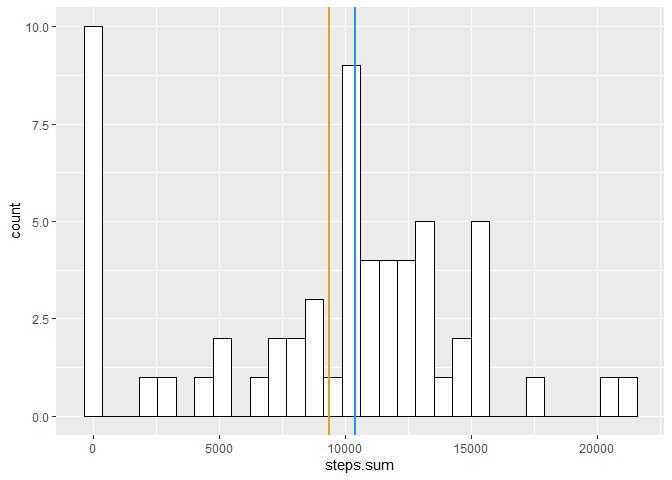
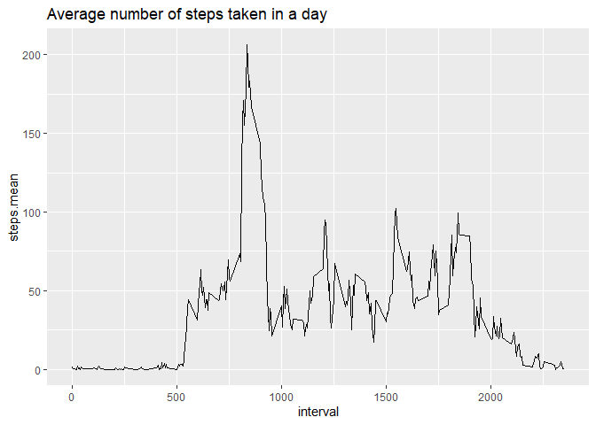
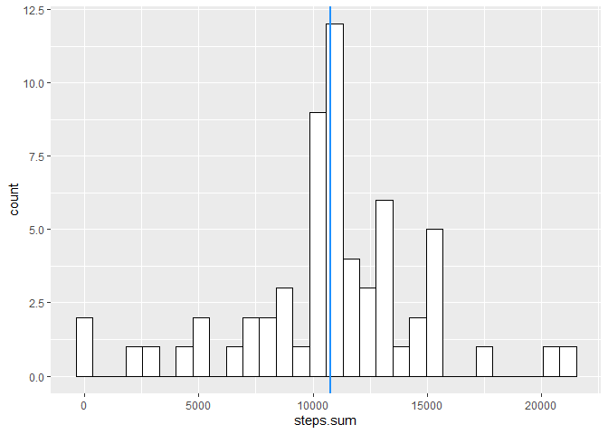
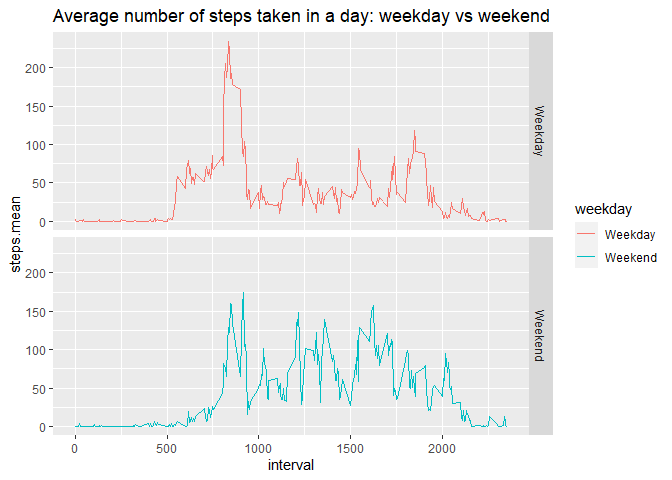

## Introduction

It is now possible to collect a large amount of data about personal movement using activity monitoring devices such as a **Fitbit**, **Nike Fuelband**, or **Jawbone Up**. These type of devices are part of the “quantified self” movement – a group of enthusiasts who take measurements about themselves regularly to improve their health, to find patterns in their behavior, or because they are tech geeks. But these data remain under-utilized both because the raw data are hard to obtain and there is a lack of statistical methods and software for processing and interpreting the data.

This assignment makes use of data from a personal activity monitoring device. This device collects data at 5 minute intervals through out the day. The data consists of two months of data from an anonymous individual collected during the months of October and November, 2012 and include the number of steps taken in 5 minute intervals each day.

The data for this assignment can be downloaded from the course web site:

Dataset: [Activity monitoring data](https://d396qusza40orc.cloudfront.net/repdata%2Fdata%2Factivity.zip) [52K]

The variables included in this dataset are:

- **steps**: Number of steps taking in a 5-minute interval (missing values are coded as $\color{red}{\text{NA}}$)

- **date**: The date on which the measurement was taken in YYYY-MM-DD format

- **interval**: Identifier for the 5-minute interval in which measurement was taken

The dataset is stored in a comma-separated-value (CSV) file and there are a total of 17,568 observations in this dataset.

## Loading and preprocessing the data

Below code is shown with echo = TRUE that is needed to

1. Load the data (i.e. $\color{red}{\text{read.csv())}}$)


```r
download.file('https://d396qusza40orc.cloudfront.net/repdata%2Fdata%2Factivity.zip'
              , 'activity.zip'
              , method='curl' )
              
unzip("activity.zip", files = NULL, exdir=".")

activity <- read.csv("activity.csv")

summary(activity)
```

```
##      steps            date              interval     
##  Min.   :  0.00   Length:17568       Min.   :   0.0  
##  1st Qu.:  0.00   Class :character   1st Qu.: 588.8  
##  Median :  0.00   Mode  :character   Median :1177.5  
##  Mean   : 37.38                      Mean   :1177.5  
##  3rd Qu.: 12.00                      3rd Qu.:1766.2  
##  Max.   :806.00                      Max.   :2355.0  
##  NA's   :2304
```

2. Process/transform the data (if necessary) into a format suitable for your analysis

## What is mean total number of steps taken per day?

For this part of the assignment, you can ignore the missing values in the dataset.

1. Calculate the total number of steps taken per day


```r
library(dplyr)
dfd <- activity %>% group_by(date) %>%
      summarise(steps.sum = sum(steps, na.rm = TRUE),
      steps.mean = mean(steps, na.rm = TRUE))
dfd
```

```
## # A tibble: 61 x 3
##    date       steps.sum steps.mean
##    <chr>          <int>      <dbl>
##  1 2012-10-01         0    NaN    
##  2 2012-10-02       126      0.438
##  3 2012-10-03     11352     39.4  
##  4 2012-10-04     12116     42.1  
##  5 2012-10-05     13294     46.2  
##  6 2012-10-06     15420     53.5  
##  7 2012-10-07     11015     38.2  
##  8 2012-10-08         0    NaN    
##  9 2012-10-09     12811     44.5  
## 10 2012-10-10      9900     34.4  
## # ... with 51 more rows
```

2. If you do not understand the difference between a histogram and a barplot, research the difference between them. Make a histogram of the total number of steps taken each day


```r
library(ggplot2)
ggplot(dfd, aes(x=steps.sum)) + 
geom_histogram(color="black", fill="white") +
geom_vline(aes(xintercept = mean(steps.sum)),col='goldenrod',size=1) +
geom_vline(aes(xintercept = median(steps.sum)),col='dodgerblue',size=1)
```

<!-- -->

3. Calculate and report the mean and median of the total number of steps taken per day


```r
summary(dfd)
```

```
##      date             steps.sum       steps.mean     
##  Length:61          Min.   :    0   Min.   : 0.1424  
##  Class :character   1st Qu.: 6778   1st Qu.:30.6979  
##  Mode  :character   Median :10395   Median :37.3785  
##                     Mean   : 9354   Mean   :37.3826  
##                     3rd Qu.:12811   3rd Qu.:46.1597  
##                     Max.   :21194   Max.   :73.5903  
##                                     NA's   :8
```
Note 2 vertical lines, mean value is 9354 as shown in gold, and median value is 10395 as shown in blue.

## What is the average daily activity pattern?

1. Make a time series plot (i.e. $\color{red}{\text{type = "l"}}$) of the 5-minute interval (x-axis) and the average number of steps taken, averaged across all days (y-axis)


```r
dfi <- activity %>% group_by(interval) %>%
      summarise(steps.mean = mean(steps, na.rm = TRUE))

ggplot(dfi,aes(x = interval, y = steps.mean)) +
geom_line() +
ggtitle("Average number of steps taken in a day")
```

<!-- -->

2. Which 5-minute interval, on average across all the days in the dataset, contains the maximum number of steps?


```r
dfi[dfi$steps.mean == max(dfi$steps.mean), ]
```

```
## # A tibble: 1 x 2
##   interval steps.mean
##      <int>      <dbl>
## 1      835       206.
```
The maximum number of steps per 5-minute interval is 206, appears at the 8:35 in the morning.

## Imputing missing values

Note that there are a number of days/intervals where there are missing values (coded as $\color{red}{\text{NA}}$). The presence of missing days may introduce bias into some calculations or summaries of the data.

1. Calculate and report the total number of missing values in the dataset (i.e. the total number of rows with $\color{red}{\text{NA}}$s)


```r
sum(is.na(activity$steps))
```

```
## [1] 2304
```

2. Devise a strategy for filling in all of the missing values in the dataset. The strategy does not need to be sophisticated. For example, you could use the mean/median for that day, or the mean for that 5-minute interval, etc.


```r
date.has.na.steps <- activity[activity$date %in% activity[is.na(activity$steps), ]$date, ]
date.has.na.steps[is.na(date.has.na.steps$steps) == FALSE, ]
```

```
## [1] steps    date     interval
## <0 行> (或0-长度的row.names)
```

Checking those days has NA steps, and NA value always appears for whole day. Therefore we could suggest no value other than 0s if we look through days.
So strategy we would pick here is look through interval to applied mean steps to fill NAs.

3. Create a new dataset that is equal to the original dataset but with the missing data filled in.


```r
dff <- activity
for (i in 1:nrow(dff)) {
    if (is.na(dff$steps[i])) {
        dff$steps[i] <- dfi[dfi$interval == dff$interval[i], ]$steps.mean
    }
}
sum(is.na(dff$steps))
```

```
## [1] 0
```

4. Make a histogram of the total number of steps taken each day and Calculate and report the **mean** and **median** total number of steps taken per day. Do these values differ from the estimates from the first part of the assignment? What is the impact of imputing missing data on the estimates of the total daily number of steps?


```r
dffd <- dff %>% group_by(date) %>%
      summarise(steps.sum = sum(steps, na.rm = TRUE))
summary(dffd)
```

```
##      date             steps.sum    
##  Length:61          Min.   :   41  
##  Class :character   1st Qu.: 9819  
##  Mode  :character   Median :10766  
##                     Mean   :10766  
##                     3rd Qu.:12811  
##                     Max.   :21194
```

```r
ggplot(dffd, aes(x=steps.sum)) + 
geom_histogram(color="black", fill="white") +
geom_vline(aes(xintercept = mean(steps.sum)),col='goldenrod',size=1) +
geom_vline(aes(xintercept = median(steps.sum)),col='dodgerblue',size=1)
```

<!-- -->

Although it is not obvious in the plot, the 2 vertical lines kind of overlapped, as mean and median value both increased to 10766 comparing to the plot in the first part. Which means imputing missing data by interval average would increase the total daily number of steps.

## Are there differences in activity patterns between weekdays and weekends?
For this part the $\color{red}{\text{weekdays()}}$ function may be of some help here. Use the dataset with the filled-in missing values for this part.

1. Create a new factor variable in the dataset with two levels – “weekday” and “weekend” indicating whether a given date is a weekday or weekend day.


```r
dfwd <- activity
dfwd$weekday <- ifelse(as.POSIXlt(as.Date(dfwd$date))$wday %in% c(0,6), "Weekend", "Weekday")
```

2. Make a panel plot containing a time series plot (i.e. $\color{red}{\text{type = "l"}}$) of the 5-minute interval (x-axis) and the average number of steps taken, averaged across all weekday days or weekend days (y-axis). See the README file in the GitHub repository to see an example of what this plot should look like using simulated data.


```r
dfwdi <- dfwd %>% group_by(weekday, interval) %>%
      summarise(steps.mean = mean(steps, na.rm = TRUE))
```

```
## `summarise()` has grouped output by 'weekday'. You can override using the `.groups` argument.
```

```r
ggplot(dfwdi,aes(x = interval, y = steps.mean)) +
geom_line(stat = "identity", aes(color = weekday)) +
facet_grid(weekday ~. ) + 
ggtitle("Average number of steps taken in a day: weekday vs weekend")
```

<!-- -->
